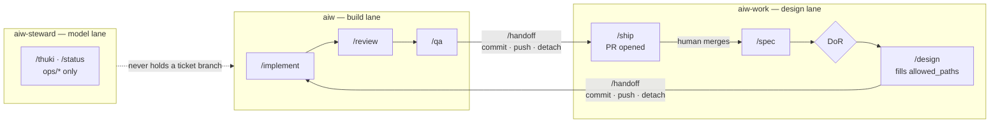

# Session model

How the agents in this system are actually started, how long they live, and how they talk. RULE-11
through RULE-16 state the policy in `.ai/registry/rules.md`; this file states the transport and the
lifecycle that deliver it. Nothing here restates a rule.

## Lifetimes

| Agent | Session | Closes when |
|---|---|---|
| `orchestrator` | persistent | end of run |
| `ba` | persistent | end of run |
| `tech-lead-design` | persistent | end of run |
| `developer` | ephemeral | ticket DONE or ESCALATED — survives REWORK |
| `tech-lead-review` | ephemeral | after **each** verdict, including a re-review |
| `qa` | ephemeral | after **each** verdict |
| `product` | ephemeral | task done |
| `devops` | ephemeral | task done |

**One orchestrator per lane folder, not one per run.** The table reads `persistent` and it is written
in the singular, from before there were three worktrees. Since 2026-08-24 the lead role runs in two
folders — `aiw-work` for `/next-ticket`, `/handoff` after DESIGN, and `/ship`; `aiw` for `/handoff`
after QA. It has to be two sessions rather than one, because a folder is decided by where a session is
launched and a session cannot change folder, while the files each `/handoff` commits live in that
folder's working tree. The build lane's orchestrator has exactly one job and is idle the rest of the
time; that is cheaper than the alternative, which is one session reaching into another worktree with
`git -C` — precisely what `guard-project-root.mjs` used to refuse before ADR-004 unwired it.

**Roles that get asked stay alive; roles that pass judgement die after speaking.**

The BA and the Tech Lead are the ones asked to explain what they meant, sometimes several tickets
later. A session that still holds the reasoning behind a decision answers that better than one
re-reading its own artifact cold.

A reviewer is the opposite case. A `tech-lead-review` session that remembers working through R4 on
the previous pass will not genuinely work through it again — but the code changed between passes, and
that is the whole reason a second pass exists. Its memory is a liability rather than an asset, so it
dies after each verdict and the next review starts from files. The same argument applies to QA, which
is why neither is on the persistent list.

`developer` sits between the two. It is ephemeral, but it **survives REWORK**, because rework is a
continuation of the same task with new information rather than a new task. Restarting it every cycle
would spend the RULE-06 budget on re-deriving the design instead of on fixing what the reviewer
actually found.

## The orchestrator is the lead session

It is not a subagent. It reads the board, decides what comes next, and **prints the command and the
session it belongs in**. It never invokes a stage owner.

This is what makes the table above enforceable rather than aspirational. A subagent cannot open a
fresh top-level session for a reviewer, and it cannot keep the BA's session alive across tickets — so
a dispatching orchestrator would have to simulate both, and RULE-13 would once again rest on an
agent's good behaviour. A printed instruction that a human runs is a real context boundary. A nested
call is not.

## One ticket, six commands

Each line is run in the session named. The orchestrator prints the next line after each gate.

`BACKLOG -> SPEC -> [DoR] -> READY -> DESIGN -> IN_PROGRESS -> REVIEW -> QA -> DONE`

| # | Command | Session | Produces |
|---|---|---|---|
| 1 | `/spec ROO-01` | BA — persistent | `01-story.md`, plus `invariants_touched` and `size_estimate` in `ticket.yaml` |
| — | `/next-ticket` | orchestrator — lead | the DoR evaluation; `SPEC -> READY` on a pass, back to `BACKLOG` on a fail |
| 2 | `/design ROO-01` | Tech Lead — persistent | `02-design.md`, `allowed_paths` and `size` in `ticket.yaml` |
| 3 | `/implement ROO-01` | Developer — fresh, kept until DONE or ESCALATED | code, `03-impl-log.md` |
| 4 | `/review ROO-01` | **fresh session, discarded after the verdict** | `04-review.md` |
| 5 | `/qa ROO-01` | **fresh session, discarded after the verdict** | `05-test-plan.md`, `06-test-report.md`, `tests/**` |
| 6 | `/ship ROO-01` | orchestrator — lead | PR opened; a human merges (RULE-09) |

**The unnumbered row is not optional.** SPEC runs directly out of BACKLOG, and DoR is evaluated
between SPEC and READY, because two of its six items are the BA's output. The BA does not promote its
own ticket to READY — that evaluation belongs to the orchestrator, and an agent that walks its own
work past the gate judging it has removed the gate.

On a FAIL at step 4 or 5, the failure routes per the table in `.ai/01-operating-model.md`. Re-running
`/review` opens **another** fresh session — a re-review never reuses the session that produced the
previous verdict.

## Chat is a file

There is no live message channel. A question is a file write; an answer is an amendment.

- The asking session writes `.ai/board/tickets/<ID>/99-questions.md`. Its front-matter carries
  `to: <agent>` and `asked_at: <ISO8601>`.
- The answering session amends **its own artifact** — the story, the design — appends a `## Changelog`
  line, and writes the answer into `99-questions.md` under the question.
- `.claude/hooks/chat-guard.mjs` inspects writes to `99-questions.md`: it blocks when `to:` names a
  pair the topology forbids before a verdict exists, and it counts entries against `chat_budget`.

The reason to prefer this over a message API is RULE-14. A clarification that reveals an incomplete
upstream artifact must amend that artifact — and with a file transport there is nowhere else for the
answer to live. It cannot be said and forgotten, because saying it is writing it down. A message
channel makes the amendment a second, skippable step; a file makes it the only step.

It also means `consulted` in the artifact front-matter is checkable. `99-questions.md` is the record,
so an artifact claiming no consultation while a question sits in the file is a detectable provenance
failure rather than a matter of trust.

## Three worktrees, two features at once

Adopted 2026-08-23, when MEM-01 and SEA-01 first needed to be in flight together.

**A folder is decided by where the session is launched.** There is no routing: the working directory
is the session root, `$CLAUDE_PROJECT_DIR` resolves to it, and `guard-allowed-paths.mjs` reads that
folder's `.git/HEAD` to decide which ticket an agent is judged against. Open the folder, then talk.

### The three lanes

Lanes are **pipeline stages, not roles.** An earlier draft assigned roles to folders — `ba` always in
one, `developer` always in another — and it does not survive contact with parallelism: `tech-lead-design`
would have to hold two branches at once the moment two tickets are live, and git refuses to check out
one branch in two worktrees.

| Folder | Lane | Stages | Branch it holds |
|---|---|---|---|
| `aiw` | **build** | `/implement` `/review` `/qa` `/handoff` | the ticket being built |
| `aiw-work` | **design** | `/spec` `/next-ticket` `/design` `/handoff` `/ship` | the ticket being specified, then the ticket being shipped |
| `aiw-steward` | **model** | `/thuki` `/status` `/docs-audit` | always `ops/*`, never a ticket |

**`/ship` runs in the design lane, not the build lane.** Changed 2026-08-24 on the operator's
instruction. The reason is throughput: shipping is the orchestrator reading gates, opening a pull
request and waiting on a human, and none of it needs the folder that writes `src/**`. Moving it frees
the build lane the moment QA passes.

**The branch a lane holds is not a lane's property. It travels.** One `feat/<TICKET-ID>` moves
`aiw-work -> aiw -> aiw-work`, carried by `/handoff` at each boundary. This replaces the earlier
arrangement in which each lane cut its own branch and the ticket's history was stitched together at
ship time.



### Why the handoff is after DESIGN, and why that matters

DESIGN is the last stage that writes only inside the ticket folder. It *declares* `allowed_paths`; it
does not write `src/**`. IN_PROGRESS is the first stage that does.

That single fact is what makes two features safe in parallel, and it is worth stating because
**MD-11 says the operating model's own parallel condition cannot be met.** The condition requires
`allowed_paths` to be pairwise disjoint, and `src/lib/data/types.ts` is in every feature ticket's
list — ROO-01, DEV-01 and MEM-01 all carry it, because every feature adds DTOs to one shared file.

The stagger sidesteps it rather than satisfying it. Only the build lane writes `src/**`, and only one
ticket is ever in the build lane, so the overlapping `allowed_paths` never produce two concurrent
writers. Two tickets whose lists both name `types.ts` are safe **so long as they are in different
lanes**, and unsafe the moment both reach IN_PROGRESS.

### The rule that keeps it honest

**A feature may enter the build lane only when the previous one has merged.** Not shipped — merged.
The design lane may run as far ahead as the board allows; the build lane is strictly one at a time.

**Where it holds while it waits: at `IN_PROGRESS`, in the design lane.** An earlier wording said
`READY` and was wrong — the design lane's last stage is DESIGN, whose `next_state` is `IN_PROGRESS`,
so a ticket that has finished this lane has already passed `READY`. Corrected 2026-08-24 against
SEA-01, which is the first ticket to actually occupy this position: both gates passed, nothing to do
here, and the build lane full.

**Handing the lane on is `/handoff`, and it is the orchestrator's.** MD-15 recorded that the model
mandated this position and gave nobody a way to leave it; the protocol below is the answer, adopted
2026-08-24 on the operator's instruction. A parked ticket is now a *pushed* ticket, which is a
stronger claim than a parked one and a cheaper state to resume from.

### The handoff protocol

Three commits per ticket, at three boundaries, all by `orchestrator` running `/handoff`. Full steps
in `.claude/commands/handoff.md`; what belongs here is why it has the shape it does.

| # | Where | After | What moves |
|---|---|---|---|
| 1 | `aiw-work` | `design` gate passes | `feat/<ID>` pushed carrying `01-story.md` and `02-design.md`; branch released |
| 2 | `aiw` | `qa` gate passes | the same branch pushed carrying `src/**`, `tests/**` and artifacts 03–06; branch released |
| 3 | `aiw-work` | `/ship` | `state: DONE`, board files, the pull request |

The receiving lane opens with `git fetch && git switch feat/<ID> && git pull`.

**Releasing the branch is not tidiness, it is the mechanism.** Git holds a branch name exclusively
across worktrees, and the failure is not a warning:

```
fatal: 'feat/SEA-01' is already checked out at '/Users/mpa/Desktop/aiw-work'
```

Verified by attempt, 2026-08-24. So the last step of every `/handoff` is `git switch --detach` — the
worktree keeps the same commit and the same files, and only the name is freed. A hand-off that
reported success while still holding the branch would fail in the *other* folder, minutes later,
which is the hardest place to read it.

**Why three commits and not one.** Until 2026-08-24 the answer was one, at `/ship`, and it was
coherent while every stage lived in one working tree: a commit is an assertion that a change is
coherent, and deferring it kept the assertion honest. Two worktrees make that untenable — the
artifacts a lane produced are the *input* the next lane needs, and an input that exists only as a
dirty file in a folder the next lane cannot open is not an input. So the assertion is now made three
times about three smaller things, which is a weaker claim per commit and a truer one.

**What it costs.** The build lane no longer sees the design lane's uncommitted tree, so a defect in
`02-design.md` is found after it is in history rather than before. That is the trade, and it is
acceptable because a gated artifact has already been judged — `gate: PASS` in its front-matter is the
assertion, and the commit only records it.

**The one thing that must not be inferred from this.** A pushed branch is still not a merged branch.
The rule above is unchanged: a feature enters the build lane only when the previous one has
**merged**. `/handoff` moves a ticket between lanes; it never lets a second ticket into the build
lane.

### The one surface that still collides

`.ai/board/metrics.md` and `.ai/board/backlog.md`. Every ticket appends to both, no `allowed_paths`
covers either, and two tickets in flight means two branches appending to the same lines. This has
already produced one merge conflict, on 2026-08-23, between two `ops/` branches.

**One writer: `/ship`.** Not one lane — one command. `/handoff` is explicitly forbidden to touch
either file and puts them in its second set if a stage left them dirty. Since only one ticket is ever
shipping, only one branch ever writes them, and the design lane's transitions are recorded when the
ticket ships rather than when it moves.

*Revised 2026-08-24.* The previous rule was **write them from the build lane only**, which was correct
until `/ship` moved to the design lane and took the board writes with it. Naming the command instead
of the folder is what survives the next time a stage changes lanes.

### Provisioning a worktree

`git worktree add -b <branch> ../<folder> origin/main`, then two things the command does not do:

- **`node_modules`.** `pnpm install` fails on this machine — Prisma's `preinstall` rejects Node
  v23.6.0, which is the only Node present (MD-12). Symlink the first worktree's:
  `ln -s /Users/mpa/Desktop/aiw/node_modules <folder>/node_modules`. Valid only while the branches
  share a lockfile, and nothing checks that they do.
- **`.claude/settings.local.json`.** It is gitignored, so a new worktree starts without the granted
  permissions and re-prompts for all of them. Copy it. `settings.json` needs no copying — it is
  tracked, so every worktree already has the same bytes, and the deny list and hooks come with it.

### What no longer protects this

Before ADR-004, `guard-project-root.mjs` refused any write outside the session's own folder. A session
in one worktree physically could not touch another. That guard is unwired, so **lane separation is now
a convention rather than a boundary** — an agent in the wrong folder is not stopped, it just writes to
the wrong branch.

The cheap substitute is one line at the start of a session: confirm `pwd` and
`git branch --show-current` before giving the first instruction. It catches the same error the guard
caught, at the only moment it is still free to fix.

## Every reply ends with a sign-off

Adopted 2026-08-24 on the operator's instruction. The block itself is in `CLAUDE.md`, which is the one
file every session loads, so it is defined once and reproduced nowhere.

**What it is for.** Three worktrees, seven ticket commands and nine agents mean the operator's real
question after any reply is the same four things: who answered, whether it passed, where the repository
is now, and what to type next. Before this, each of the four was somewhere different — the gate in an
artifact's front-matter, the branch nowhere at all, the next command sometimes printed and sometimes
not. Putting them in a fixed place at a fixed time is worth more than any one of them.

**Two failure modes it must not have**, and both are likelier than they look:

- **A fabricated timestamp or branch.** Both are cheap to read — `date` and
  `git branch --show-current` — and both are exactly the kind of value a language model will supply
  from context rather than from the machine. A sign-off is a claim about the state of a repository. An
  invented one is worse than none, because it looks like it was measured. An agent holding no `Bash`
  tool writes `unavailable` and says why; `product` is the case that exists today.
- **The block leaking into an artifact.** It is conversation, addressed to one reader. Artifacts carry
  front-matter with `gate`, `produced_at` and `inputs_read`, and that is the record. A sign-off pasted
  into `01-story.md` is noise in a document that a reviewer, a QA session and a human all read later.

**It does not replace the gate.** The gate is in the artifact's front-matter and the sign-off quotes
it. If the two ever disagree, the artifact is right — a sign-off is a summary and summaries drift.

## Phase 2 — Agent Teams

The intended next step is to move SPEC, DESIGN and IN_PROGRESS onto Agent Teams, so the constructing
roles share a live session, while REVIEW and QA stay exactly as they are: fresh, isolated, files
only. The isolation of the judging roles is not negotiable and is not what Phase 2 changes.

It is not adopted yet, and the reasons are worth stating plainly rather than discovering later:

- **Experimental.** The feature is behind a flag and its behaviour may change. Building the loop's
  correctness on it now would mean debugging the harness and the process at the same time.
- **Roughly 7x the tokens.** A live multi-agent session re-sends shared context on every turn. That
  is affordable for a hard design conversation and wasteful for the routine tickets that make up most
  of a board.
- **Team configuration lives outside the repository**, under `~/.claude/`. This is the serious one.
  Everything else governing this system — rules, invariants, permissions, hooks — is in the repo,
  reviewable in a pull request, and covered by CODEOWNERS. A team definition in a home directory is
  none of those things: it cannot be reviewed, it drifts per machine, and a change to it changes how
  agents collaborate with no diff anywhere. Until that configuration can be committed, adopting Agent
  Teams would move a load-bearing part of the process out of version control, which is the opposite
  of what the two-plane model is for.

**Revisit when** team configuration can live in the repository, or when the file transport above is
measured to be the bottleneck. Not before. The current transport is slower per clarification and
fully auditable, and auditability is what is being validated on the first tickets.
